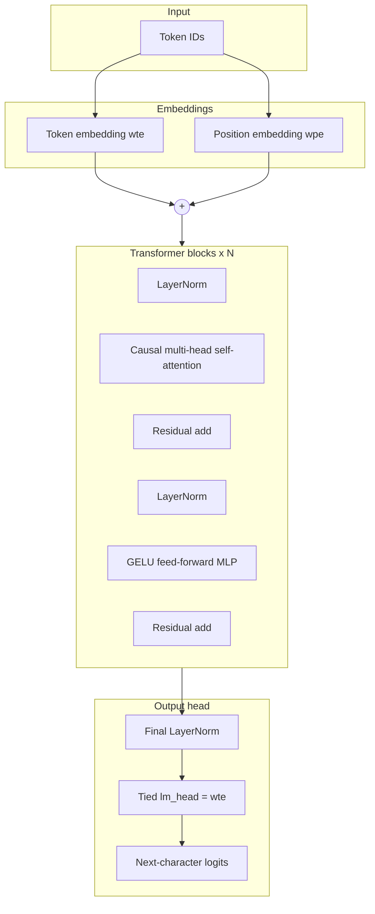

# Local GPT — comprehensive guide

This document describes the decoder-only GPT transformer in this repository: how it
is built, how to train it on local hardware (including AMD Radeon GPUs), and how
to query it from the command line or over HTTP.

The NumPy learning path in this repo teaches attention and backprop from first
principles. The GPT module is a **production-style PyTorch implementation** that
applies those ideas at scale on your own machine.

---

## Table of contents

1. [Overview](#overview)
2. [Architecture](#architecture)
3. [Hardware and PyTorch builds](#hardware-and-pytorch-builds)
4. [Installation](#installation)
5. [Project layout](#project-layout)
6. [Model presets](#model-presets)
7. [Training data](#training-data)
8. [Training](#training)
9. [Querying the model](#querying-the-model)
10. [HTTP API](#http-api)
11. [Python API](#python-api)
12. [Testing](#testing)
13. [Troubleshooting](#troubleshooting)
14. [Extending the system](#extending-the-system)

---

## Overview

You get a complete local language-model pipeline:

| Stage | Tool | Output |
|-------|------|--------|
| Train | `scripts/train_gpt.py` | `checkpoint.pt`, `tokenizer.json` |
| Chat | `scripts/chat_gpt.py` | Interactive or one-shot Q&A |
| Serve | `scripts/serve_gpt.py` | REST API on `http://127.0.0.1:8000` |

The model is a **character-level GPT**: each token is a single UTF-8 character.
This keeps the vocabulary small, training fast, and the implementation easy to
inspect. Quality improves with more compute (iterations, model size, GPU).

**Recommended hardware:** AMD Radeon RX 5700 XT (8 GB VRAM) or equivalent. The
default preset `rx5700xt` is sized for that card.

---

## Architecture

The model follows the GPT-2 design: a stack of transformer blocks with **causal
(self-attention masked)** so each position only sees past tokens.



### Components (code map)

| Component | File | Role |
|-----------|------|------|
| `GPTConfig`, `TrainConfig`, presets | `src/deep_learning_from_scratch/gpt/config.py` | Hyperparameters |
| `GPT`, `Block`, `CausalSelfAttention`, `MLP` | `src/deep_learning_from_scratch/gpt/model.py` | Model |
| `CharTokenizer` | `src/deep_learning_from_scratch/gpt/tokenizer.py` | Char ↔ id mapping |
| `load_text_corpus`, `get_batch` | `src/deep_learning_from_scratch/gpt/dataset.py` | Data loading |
| `train_gpt` | `src/deep_learning_from_scratch/gpt/train.py` | Training loop |
| `generate_text` | `src/deep_learning_from_scratch/gpt/generate.py` | Inference helper |
| `get_device`, mixed precision | `src/deep_learning_from_scratch/gpt/device.py` | GPU/CPU selection |

### Training objective

For input sequence `x` and targets `y` (input shifted by one character), the model
minimizes **cross-entropy** over the vocabulary at every position:

```text
loss = CrossEntropy(lm_head(transformer(x)), y)
```

### Generation

At inference time the model autoregressively appends one character at a time:

1. Forward pass on the current context (truncated to `block_size`).
2. Read logits for the last position.
3. Apply temperature scaling and optional top-k filtering.
4. Sample (or argmax for greedy) the next token.
5. Repeat until `max_new_tokens`.

---

## Hardware and PyTorch builds

### AMD Radeon RX 5700 XT (Linux + ROCm) — recommended

The 5700 XT has **8 GB VRAM**. On Linux, install the **ROCm build** of PyTorch.
ROCm registers the GPU through `torch.cuda`, so no code changes are required.

Supported gfx10 cards include `gfx1010` (5700 XT). Verify with:

```bash
rocminfo | grep -i gfx
```

Use a recent ROCm user-space stack (6.x) and match the PyTorch wheel index to
your ROCm version. Example:

```bash
python -m pip install torch --index-url https://download.pytorch.org/whl/rocm6.2
```

See [PyTorch ROCm install docs](https://pytorch.org/get-started/locally/) for
the current index URL for your ROCm version.

### NVIDIA CUDA

```bash
python -m pip install torch --index-url https://download.pytorch.org/whl/cu124
```

Training and inference commands are identical; `get_device()` selects CUDA when
available.

### Apple Silicon (MPS)

PyTorch MPS is supported. Mixed precision uses float16 on MPS automatically when
enabled.

### CPU-only

Works for tests and small experiments. Use `--cpu` on scripts or install the CPU
wheel:

```bash
python -m pip install torch --index-url https://download.pytorch.org/whl/cpu
```

### Windows + AMD

Native ROCm on Windows is limited. Practical options:

- **WSL2 + ROCm** (best Linux parity)
- **DirectML** PyTorch build (separate install; not wired into this repo by default)

---

## Installation

From the repository root:

```bash
python -m venv .venv
source .venv/bin/activate   # Windows: .venv\Scripts\activate

# 1. Install PyTorch for YOUR platform (see above)
python -m pip install torch --index-url https://download.pytorch.org/whl/rocm6.2

# 2. Install this project with GPT + dev + optional API extras
python -m pip install -e ".[gpt,dev,api]"
```

Verify:

```bash
python -c "import torch; print(torch.__version__, torch.cuda.is_available())"
pytest tests/test_gpt.py tests/test_gpt_integration.py -q
```

---

## Project layout

```text
data/gpt/
  instruct.txt          # Bundled Q&A examples (committed)
  shakespeare.txt       # Downloaded on first train run (gitignored)

scripts/
  train_gpt.py          # Training CLI
  chat_gpt.py           # Interactive / one-shot chat
  serve_gpt.py          # FastAPI server

src/deep_learning_from_scratch/gpt/
  config.py             # GPTConfig, TrainConfig, PRESETS
  model.py              # Transformer implementation
  tokenizer.py          # Character tokenizer
  dataset.py            # Corpus loading and batches
  train.py              # Training loop
  generate.py           # Text generation
  device.py             # Device and AMP helpers

checkpoints/gpt/        # Default output (gitignored)
  checkpoint.pt
  tokenizer.json

docs/local_gpt.md       # This file
tests/test_gpt.py       # Unit tests
tests/test_gpt_integration.py  # Train / API integration tests
```

---

## Model presets

Presets are defined in `PRESETS` inside `config.py`:

| Preset | block_size | layers | heads | embd | ~params | Use case |
|--------|------------|--------|-------|------|---------|----------|
| `tiny` | 128 | 4 | 4 | 128 | ~0.8M | CI, smoke tests, CPU demos |
| `rx5700xt` | 512 | 8 | 8 | 512 | ~25M | **Default for 5700 XT** |
| `local-large` | 1024 | 12 | 12 | 768 | ~85M | Heavier; tighter VRAM fit |

Parameter counts depend on corpus vocabulary size (character count).

Override context length without changing preset depth:

```bash
python scripts/train_gpt.py --preset rx5700xt --block-size 256
```

---

## Training data

### Default corpora

1. **`data/gpt/instruct.txt`** — Question/Answer pairs (`Question: …\nAnswer: …`).
   Repeated **`--instruct-repeats`** times (default **80**) so factual patterns
   are not drowned out by Shakespeare.

2. **`data/gpt/shakespeare.txt`** — Tiny Shakespeare (~1 MB). Downloaded
   automatically on first training run if missing.

### Custom data

Add files:

```bash
python scripts/train_gpt.py --data path/to/my_notes.txt path/to/faq.txt
```

Train **only** on your files:

```bash
python scripts/train_gpt.py --data-only --data path/to/faq.txt
```

### Train/validation split

The corpus is split **contiguously** (90% train / 10% val by default) so local
character n-gram structure is preserved. Configure via `TrainConfig.train_split`
when calling `train_gpt()` programmatically.

---

## Training

### Basic command (5700 XT)

```bash
python scripts/train_gpt.py --preset rx5700xt --max-iters 5000
```

Artifacts written to `checkpoints/gpt/`:

- `checkpoint.pt` — weights + config metadata
- `tokenizer.json` — character vocabulary

### All training CLI flags

| Flag | Default | Description |
|------|---------|-------------|
| `--preset` | `rx5700xt` | `tiny`, `rx5700xt`, `local-large` |
| `--output-dir` | `checkpoints/gpt` | Checkpoint directory |
| `--max-iters` | `5000` | Optimization steps |
| `--batch-size` | `32` (16 for `local-large`) | Sequences per step |
| `--block-size` | preset value | Context length in characters |
| `--learning-rate` | `3e-4` | Peak learning rate |
| `--seed` | `42` | Reproducibility |
| `--cpu` | off | Force CPU |
| `--instruct-repeats` | `80` | Repeat factor for instruct corpus |
| `--data` | — | Extra corpus paths |
| `--data-only` | off | Skip default corpora |

### Training mechanics

- **Optimizer:** AdamW with weight decay on 2D weights only
- **LR schedule:** Linear warmup → cosine decay to `min_lr`
- **Regularization:** Dropout (preset-dependent), gradient clip at 1.0
- **Mixed precision:** Enabled on GPU when `--cpu` is not set
- **Checkpointing:** Best validation loss saved each eval interval

### Suggested training budgets

| Goal | Preset | `--max-iters` | Notes |
|------|--------|---------------|-------|
| Smoke test | `tiny` | 300–500 | Minutes on CPU |
| Demo Q&A | `tiny` | 6000+ | Good instruct recall on CPU |
| Local production | `rx5700xt` | 5000–15000 | Use GPU; ~minutes–hours |
| Fluency + facts | `rx5700xt` | 10000+ | Increase `--instruct-repeats` if needed |

Monitor `train` and `val` loss in the log. Val loss should trend downward; a large
gap between train and val suggests overfitting on a tiny corpus.

---

## Querying the model

### Interactive chat

```bash
python scripts/chat_gpt.py
```

Type questions at the `You>` prompt. Exit with `quit` or Ctrl+C.

### One-shot query

```bash
python scripts/chat_gpt.py --prompt "What does GPT stand for?"
```

### Chat CLI flags

| Flag | Default | Description |
|------|---------|-------------|
| `--checkpoint` | `checkpoints/gpt/checkpoint.pt` | Model weights |
| `--tokenizer` | `checkpoints/gpt/tokenizer.json` | Vocabulary |
| `--max-new-tokens` | `120` | Generation length |
| `--temperature` | `0.2` | Sampling randomness |
| `--top-k` | `20` | Top-k sampling cutoff |
| `--greedy` | off | Argmax decoding (best for facts) |
| `--cpu` | off | Force CPU |
| `--prompt` | — | Single question; skip REPL |

### Prompt format

The chat script wraps your input:

```text
Question: <your question>
Answer:
```

It then extracts text after `Answer:` and before the next `Question:` block.

### Greedy vs sampling

| Mode | Flag | When to use |
|------|------|-------------|
| Greedy | `--greedy` | Factual Q&A from instruct corpus |
| Sampling | default | Creative / Shakespeare-style continuation |

Example:

```bash
python scripts/chat_gpt.py --greedy --prompt "What is 2 + 2?"
# Expected after sufficient training: 4.
```

---

## HTTP API

Install API extras and start the server:

```bash
python -m pip install -e ".[gpt,api]"
python scripts/serve_gpt.py --checkpoint checkpoints/gpt/checkpoint.pt
```

### Endpoints

#### `GET /health`

```json
{"status": "ok", "device": "cuda"}
```

#### `POST /query`

Request body:

```json
{
  "prompt": "What does GPT stand for?",
  "max_new_tokens": 120,
  "temperature": 0.2,
  "top_k": 20,
  "greedy": true
}
```

Response:

```json
{
  "prompt": "What does GPT stand for?",
  "answer": "Generative Pre-trained Transformer.",
  "raw_text": "Question: What does GPT stand for?\nAnswer: Generative Pre-trained Transformer.\n\n"
}
```

### Example curl session

```bash
curl http://127.0.0.1:8000/health

curl -X POST http://127.0.0.1:8000/query \
  -H 'Content-Type: application/json' \
  -d '{"prompt":"Who wrote Romeo and Juliet?","greedy":true}'
```

### Serve CLI flags

| Flag | Default | Description |
|------|---------|-------------|
| `--checkpoint` | `checkpoints/gpt/checkpoint.pt` | Model path |
| `--tokenizer` | `checkpoints/gpt/tokenizer.json` | Tokenizer path |
| `--host` | `127.0.0.1` | Bind address |
| `--port` | `8000` | Port |
| `--cpu` | off | Force CPU |

---

## Python API

### Load and generate

```python
import torch
from deep_learning_from_scratch.gpt.model import GPT
from deep_learning_from_scratch.gpt.tokenizer import CharTokenizer
from deep_learning_from_scratch.gpt.generate import generate_text
from deep_learning_from_scratch.gpt.device import get_device

device = get_device()
model = GPT.from_checkpoint("checkpoints/gpt/checkpoint.pt", map_location=device)
model.to(device)
tokenizer = CharTokenizer.load("checkpoints/gpt/tokenizer.json")

text = generate_text(
    model=model,
    tokenizer=tokenizer,
    prompt="Question: What is ROCm?\nAnswer:",
    max_new_tokens=80,
    temperature=0.1,
    top_k=20,
    do_sample=False,  # greedy
    device=device,
)
print(text)
```

### Train programmatically

```python
from pathlib import Path
from deep_learning_from_scratch.gpt.config import PRESETS, TrainConfig
from deep_learning_from_scratch.gpt.train import train_gpt

result = train_gpt(
    data_paths=[Path("data/gpt/instruct.txt")],
    output_dir="checkpoints/my_run",
    model_config=PRESETS["tiny"],
    train_config=TrainConfig(max_iters=1000, use_amp=False),
)
print(result.checkpoint_path, result.val_loss)
```

---

## Testing

Run the full suite:

```bash
pytest
```

GPT-specific tests:

```bash
pytest tests/test_gpt.py tests/test_gpt_integration.py -v
```

| Test file | Covers |
|-----------|--------|
| `test_gpt.py` | Tokenizer, forward pass, generation smoke |
| `test_gpt_integration.py` | Mini training run, chat helpers, FastAPI `/query` |

End-to-end manual check after training:

```bash
python scripts/train_gpt.py --preset tiny --max-iters 6000 --cpu --output-dir checkpoints/gpt-demo
python scripts/chat_gpt.py --greedy --checkpoint checkpoints/gpt-demo/checkpoint.pt \
  --tokenizer checkpoints/gpt-demo/tokenizer.json --prompt "What does GPT stand for?"
```

---

## Troubleshooting

### `Using CPU` when a GPU is expected

- Confirm ROCm/CUDA PyTorch wheel matches your driver stack.
- Run `python -c "import torch; print(torch.cuda.is_available())"`.
- On AMD Linux, ensure your user is in the `render` / `video` groups if required
  by your distro.

### Out of memory (OOM)

- Use `--preset tiny` or reduce `--batch-size`.
- Reduce `--block-size`.
- Close other GPU applications (browser, games).

### Gibberish or repeated characters

- Model under-trained: increase `--max-iters`.
- Use `--greedy` for factual Q&A.
- Increase `--instruct-repeats` if Q&A answers are wrong but Shakespeare works.

### Truncated answers

- Increase `--max-new-tokens` in chat or API requests.

### `Missing checkpoint` when chatting

Train first:

```bash
python scripts/train_gpt.py --preset rx5700xt --max-iters 5000
```

### Shakespeare download fails

Manually download:

```bash
mkdir -p data/gpt
curl -L -o data/gpt/shakespeare.txt \
  https://raw.githubusercontent.com/karpathy/char-rnn/master/data/tinyshakespeare/input.txt
```

---

## Extending the system

### Add Q&A knowledge

Append to `data/gpt/instruct.txt`:

```text
Question: What is your custom fact?
Answer: Your answer here.

```

Retrain or fine-tune with `--data data/gpt/instruct.txt` and high
`--instruct-repeats`.

### New preset

Edit `PRESETS` in `config.py`. Keep `n_embd % n_head == 0`. Estimate VRAM:

```text
rough_memory ≈ 4 × parameter_count bytes (fp32)
             ≈ 2 × parameter_count bytes (mixed precision)
```

Stay under ~6–7 GB activations+weights combined on an 8 GB card by lowering
batch size or block size.

### Subword / BPE tokenizer

Replace `CharTokenizer` with a BPE implementation and adjust `vocab_size` in
config. The model code is tokenizer-agnostic as long as ids are integers in
`[0, vocab_size)`.

### Link to the NumPy curriculum

- Lesson 06 (`lessons/06_attention.md`) — attention mechanism used inside GPT
- Lesson 07 capstone — compare this PyTorch GPT with scratch NumPy attention

---

## Quick reference

```bash
# Install
python -m pip install torch --index-url https://download.pytorch.org/whl/rocm6.2
python -m pip install -e ".[gpt,dev,api]"

# Train (5700 XT)
python scripts/train_gpt.py --preset rx5700xt --max-iters 5000

# Query
python scripts/chat_gpt.py --greedy --prompt "What does GPT stand for?"

# Serve
python scripts/serve_gpt.py

# Test
pytest
```
